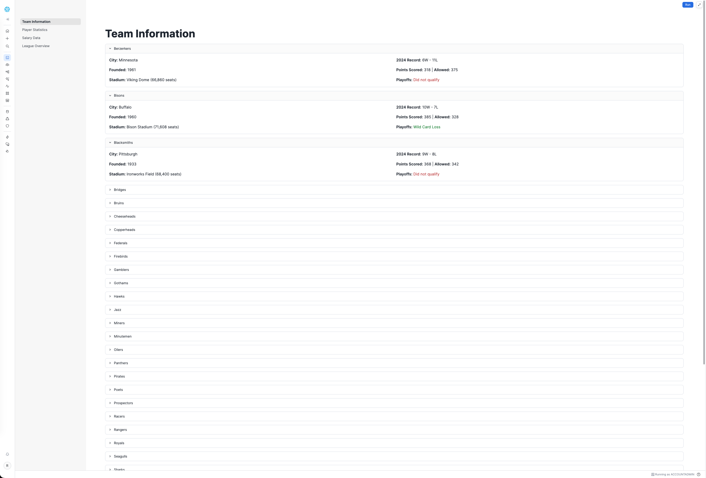
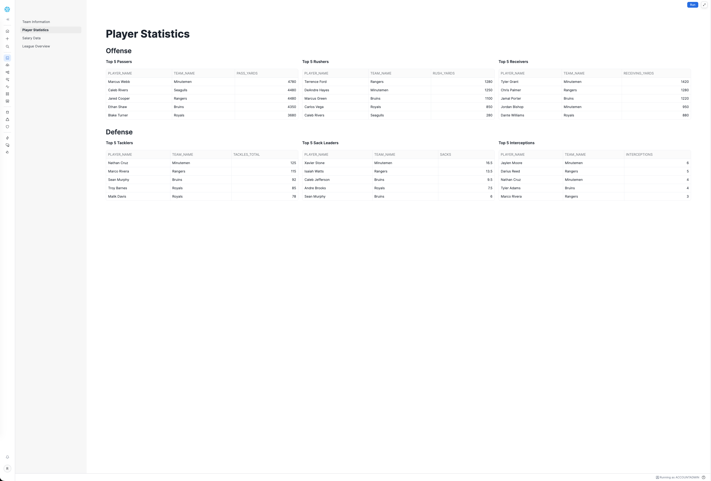
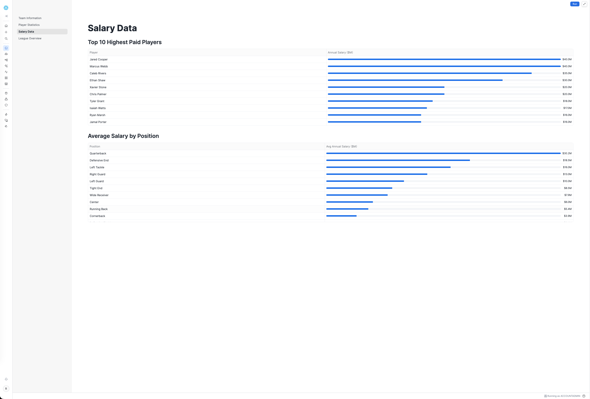
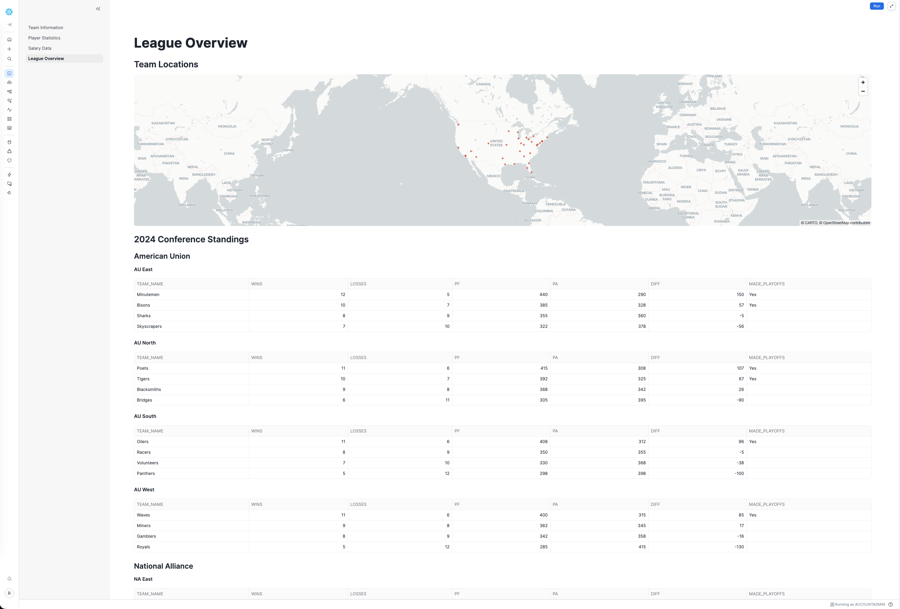
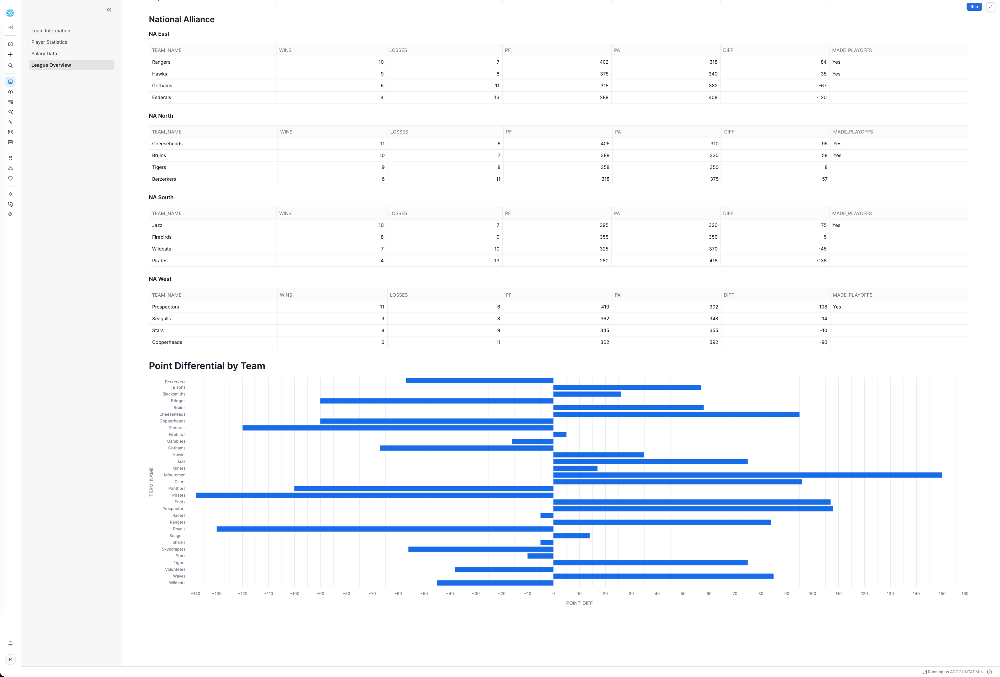

# Snowflake CoCo Labs Learning Reference

Personal learning reference for [Snowflake Cortex Code (CoCo)](https://docs.snowflake.com/en/user-guide/ui-snowsight/cortex-code) labs, covering data discovery, SQL optimization, pipeline building and Streamlit dashboard development.

## Labs Overview

### Lab 01 — Lab Setup and Exploration
Introduction to Snowflake CoCo: setting up permissions, creating a warehouse, exploring the chat interface, switching LLM models, managing chat history, and monitoring credit usage.

### Lab 02 — Data Discovery and Exploration
Using CoCo to explore an unfamiliar database (PFL — Professional Football League) without memorising table names. Covers table/view discovery, `@` mentions for object references, relationship mapping, and generating analytical SQL through natural language prompts.

### Lab 03 — Explain, Fix, and Optimize
Working with a colleague's inherited codebase. Using CoCo's **Explain** feature on SQL and Python, fixing broken queries with the **Fix error** button, adding code comments, modifying queries to add functionality, and optimising slow SQL by replacing correlated subqueries with window functions.

### Lab 04 — Build a Pipeline
Creating a data pipeline with CoCo: designing an INJURIES table using CoCo's recommendations, using **Plan Mode** to review before execution, generating realistic sample data, building an automated ingestion pipeline (stage → stream → task) for CSV files, and testing incremental loads.

### Lab 05 — Build a Data Application (Challenge Lab)
Building an interactive Streamlit dashboard entirely through natural language prompts. This is a challenge lab requiring iterative prompting and debugging.

## PFL Dashboard (Streamlit App)

The `pfl-dashboard/` directory contains a multi-page Streamlit app built during Lab 05 and extended with additional features.

### Team Information
Expandable cards for all 32 teams showing city, founding year, stadium details, 2024 win/loss record, points scored/allowed, and colour-coded playoff results.



### Player Statistics
Offence and defence leaders in a six-column layout: Top 5 Passers, Rushers, and Receivers alongside Top 5 Tacklers, Sack Leaders, and Interception Leaders — all from the 2024 season.



### Salary Data
Tables with inline progress bars showing the 10 highest-paid players by annual salary and average salary by position, sorted from highest to lowest.



### League Overview
A map plotting all 32 team cities across the US, full conference/division standings with point differentials and playoff indicators, and a point differential bar chart for every team.




## Project Structure

```
├── Lab01-Lab_Setup_And_Exploration.ipynb
├── Lab02-Data_Discovery_and_Exploration.ipynb
├── Lab03-Explain_Fix_and_Optimize.ipynb
├── Lab04-Build_Pipeline.ipynb
├── Lab05-Build_Data_App.ipynb
├── Lab Materials/
│   ├── injuries_001.csv.gz
│   └── injuries_002.csv.gz
├── resources/
│   ├── img/                    # Lab instruction screenshots
│   ├── setup_pfl.py            # PFL database setup script
│   └── setup_pfl_data.sql      # PFL data seed SQL
├── pfl-dashboard/
│   ├── streamlit_app.py        # Main entry point with navigation
│   ├── snowflake.yml           # Snowflake deployment config
│   ├── pyproject.toml          # Python dependencies
│   ├── .streamlit/config.toml  # Streamlit theme config
│   └── app_pages/
│       ├── team_information.py
│       ├── player_statistics.py
│       ├── salary_data.py
│       └── league_overview.py
└── screenshots/                # App screenshots (add manually)
```

## Data Model

The labs use the **PFL_DB.STATS_AND_INFO** schema — a fictional Professional Football League dataset containing:

| Table | Description |
|-------|-------------|
| TEAMS | 32 teams with city, stadium, colours |
| PLAYERS | Player profiles, college, draft info |
| PLAYER_SEASON_STATS | Per-player passing, rushing, receiving, defensive stats |
| TEAM_SEASON_STATS | Team-level wins, losses, points, playoff results |
| PLAYER_CONTRACTS | Salary and contract details |
| GAMES | Game-by-game scores and attendance |
| CONFERENCES / DIVISIONS | League structure |
| SEASONS | Season date ranges |
| POSITIONS | Position definitions and groupings |
| DRAFT_PICKS | Draft history |
| INJURIES | Player injury tracking (created in Lab 04) |

## Key Takeaways

- **Lab 01**: CoCo interface, model selection, cost management
- **Lab 02**: Natural language data discovery, `@` object references, analytical SQL generation
- **Lab 03**: Code explanation, error fixing, query optimisation with window functions
- **Lab 04**: Table design with AI recommendations, Plan Mode, automated pipeline creation
- **Lab 05**: Iterative Streamlit app development through conversational prompting
